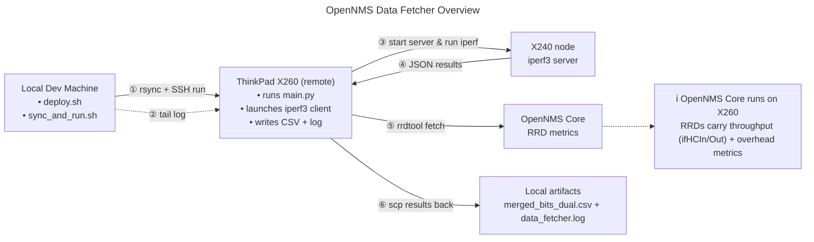

# OpenNMS Data Fetcher

This project automates active bandwidth sampling with `iperf3`, lines the results up with OpenNMS RRD counters, and writes a single CSV so you can compare synthetic throughput and SNMP measurements side by side.



At a glance:
- Runs two `iperf3` passes (normal + reverse) against a remote host accessed over Tailscale.
- Retrieves the server JSON logs, rescales them to the OpenNMS RRD interval, and fetches `ifHCIn/OutOctets` from your OpenNMS server.
- Aligns everything on a common timestamp grid, then exports `merged_bits_dual.csv`.

## Repository Layout

- `main.py` – The main data fetching and processing script.
- `deploy.sh` – Deploys the repository to a remote host using Git.
- `sync_and_run.sh` – Syncs local changes and executes the script on a remote host.
- `merged_bits_dual-*.csv` – Sample merged output.

## Prerequisites

### Local machine
- Python 3.10+ with `pandas` and the Python `rrdtool` bindings installed.
- `iperf3`, `ssh`, `scp`, and `rsync`.

Suggested packages on Ubuntu/Debian:

```bash
sudo apt update
sudo apt install python3 python3-pip python3-rrdtool iperf3 openssh-client rsync
pip install --user pandas
```

### Windows note (WSL & rsync)

`sync_and_run.sh` depends on `rsync`. Run the helper scripts from Windows Subsystem for Linux (WSL) where `rsync`, `ssh`, and other GNU tools are available. Example:

```bash
wsl
cd /home/<user>/opennms-data-fetcher
./sync_and_run.sh
```

### Remote hosts

There are two remote endpoints referenced in the scripts:

- **iperf3 target (`main.py`)** – default `REMOTE_HOST=100.71.60.46`. This machine must have `iperf3` installed and be accessible over SSH.
- **Execution target (`deploy.sh`, `sync_and_run.sh`)** – default `100.97.19.21`. This is the machine where the code is deployed and executed. It must have `git` (for `deploy.sh`) and all the Python dependencies listed above (for `sync_and_run.sh`).

Adjust the IPs, usernames, and key paths in each script to match your environment.

## Script Permissions

Before running the helper scripts, make them executable:

```bash
chmod +x deploy.sh sync_and_run.sh
```

## SSH Key Setup (Ed25519)

The scripts use Ed25519 keys (for example `~/.ssh/id_ed25519_opennms`). To create one:

```bash
ssh-keygen -t ed25519 -f ~/.ssh/id_ed25519 -C "your_email_address"
chmod 600 ~/.ssh/id_ed25519
```

Copy the public key to every remote host used by the project:

```bash
ssh-copy-id -i ~/.ssh/id_ed25519.pub tung196@<remote-host>
```

If `ssh-copy-id` is unavailable, append the contents of `~/.ssh/id_ed25519_opennms.pub` to the remote `~/.ssh/authorized_keys` file manually.

## Configuration

Most tunables live near the top of `main.py`:

- `REMOTE_USER`, `REMOTE_HOST`, `SSH_KEY_PATH` – SSH settings for `iperf3` remote control.
- `IPERF_DURATION`, `IPERF_BW`, `IPERF_RESOLUTION` – test length and bandwidth.
- `RRD_IN`, `RRD_OUT`, `RRD_RESOLUTION` – paths and granularity for OpenNMS `.rrd` files.
- `CSV_OUT`, `JSON_DIR`, `LOG_FILE` – output locations.

Review and update these before running the script in a new environment.

## Running the Fetcher Locally

```bash
python3 main.py
```

Output artifacts:

- `json_data/` – raw `iperf3` server JSON files for inbound/outbound runs.
- `merged_bits_dual.csv` – merged dataset (timestamps, RRD in/out, iperf in/out).
- `data_fetcher.log` – execution log with timing, SSH, and overlap diagnostics.

## Remote Workflows

There is a two-step process for running the fetcher remotely:

### 1. Initial Deployment

First, use `deploy.sh` to clone the repository onto your execution target machine. You only need to do this once.

```bash
./deploy.sh
```
This connects to the host, creates the directory, and clones the `master` branch from GitHub.

### 2. Sync and Run

For all subsequent runs, use `sync_and_run.sh`. This is your main script for development and testing.

```bash
./sync_and_run.sh
```
This script uses `rsync` to mirror your local working directory to the remote host (which is much faster than a full git push/pull) and then executes `main.py`.

Ensure the SSH key referenced in each script matches the key you generated earlier.

## Troubleshooting Tips

- **Missing `rrdtool` module:** Install `python3-rrdtool` via the system package manager; the pip wheel is not published for all platforms.
- **No overlap between RRD and iperf data:** Increase the post-test wait (`time.sleep(RRD_RESOLUTION * 2)`) or verify the OpenNMS polling interval.
- **Permission errors on SSH key:** Confirm key file permissions are `600` (or `600` equivalent on Windows via WSL) and that the public key is in the remote `authorized_keys`.

Feel free to adapt the scripts for different hosts or output formats as your monitoring setup evolves.
